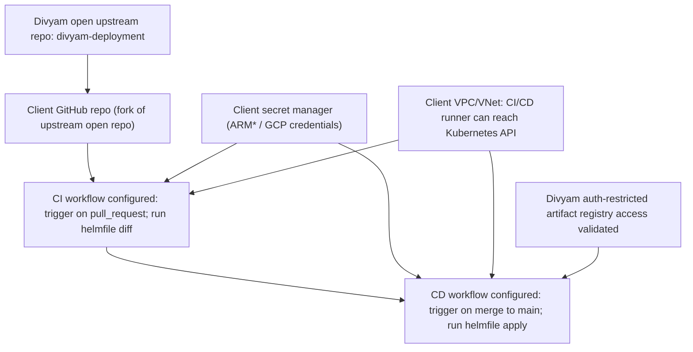
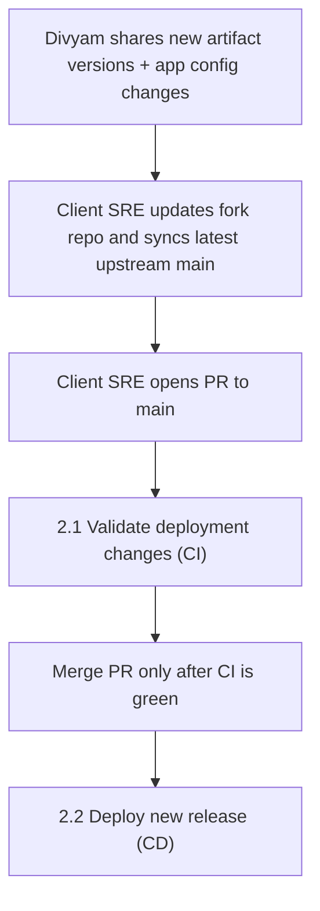
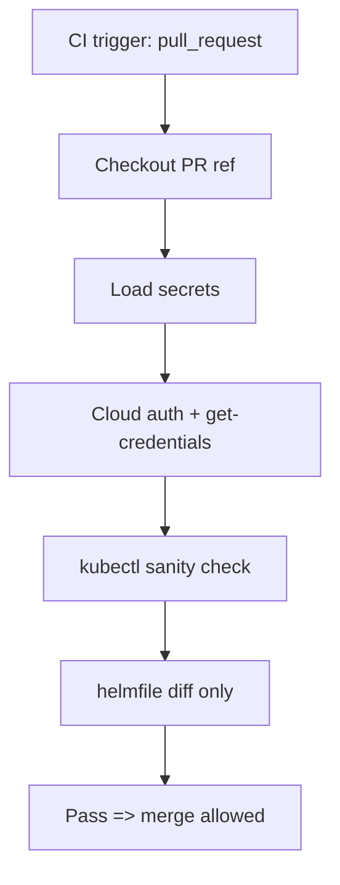
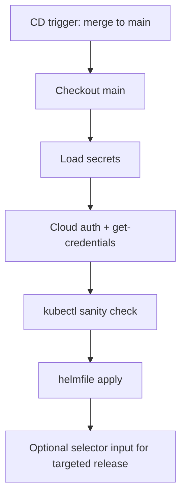

# Divyam Kubernetes CI/CD Overview (Client SRE Fork Model)

This document is organized by workflows:

- **Process 1** is a **one-time** pipeline setup activity (or occasional platform reconfiguration).
- **Process 2** is a **repeated** activity for ongoing live deployment updates.

> [!NOTE]
> The client GitHub repository is a fork of Divyam's open upstream repo (`divyam-deployment`).

## 1: Set Up The Pipelines (One-Time)



### Manual Steps

1. Create and maintain a client-owned GitHub fork of Divyam's open upstream repository.
2. Ensure the CI/CD runner runs in the same VPC/VNet (or has equivalent private connectivity) as the Kubernetes cluster.
3. Validate runner connectivity to cluster API and to Divyam's auth-restricted artifact registry.
4. Configure secret manager entries for cloud auth.
5. Configure CI trigger on pull requests and block merge on CI failure.
6. Configure CD trigger on merge to `main`.
7. Test both workflows with a non-production change before production use.

Fork command example:

```bash
git clone https://github.com/<your-org>/divyam-deployment.git
cd divyam-deployment
git remote add upstream https://github.com/Divyam-AI/divyam-deployment.git
git fetch upstream
```

### Pipeline and Secret Inputs

#### Secret manager values

| Variable | Classification | Guidance |
| --- | --- | --- |
| `ARM_CLIENT_ID` | Identifier (low sensitivity) | Can be plain variable with RBAC, or bundled with secrets. |
| `ARM_CLIENT_SECRET` | Secret (required) | Must be stored as a secret; never commit to git or print in logs. |
| `ARM_TENANT_ID` | Identifier (low sensitivity) | Same handling as `ARM_CLIENT_ID`. |
| `ARM_SUBSCRIPTION_ID` | Identifier (low sensitivity) | Same handling as `ARM_CLIENT_ID`. |
| `GCP_SA_KEY_JSON` | Secret (required for GCP) | Service account key JSON, injected at runtime. |

> [!NOTE]
> Azure names are standardized in this repo as `ARM_CLIENT_ID`, `ARM_CLIENT_SECRET`, `ARM_SUBSCRIPTION_ID`, `ARM_TENANT_ID`.

#### Non-secret runtime variables

- `CLUSTER_PROVIDER` (`gcp` or `azure`)
- `HELMFILE_ENV` (example: `prod`, `preprod`)
- `HELMFILE_VALUES_DIR` (path to values directory)
- `HELMFILE_FILE` (default: `helmfile.yaml.gotmpl`)

#### Pipeline container and scripts

- Common image: `pipeline/Dockerfile` (Ubuntu `24.04`, pinned)
- Shared script library: `pipeline/scripts/lib.sh`
- CI entrypoint: `pipeline/scripts/ci_validate.sh`
- CD entrypoint: `pipeline/scripts/cd_deploy.sh`

## 2: Update A Live Divyam Installation (Repeated)



### Manual Steps

1. Receive artifact version and configuration change instructions.
2. Update corresponding files in the fork repo.
3. Sync latest upstream `main` from Divyam's open repo into the fork.
4. Raise a PR to `main` in client GitHub.
5. Review CI results and fix issues if validation fails.
6. Approve and merge PR only when CI is successful.
7. Monitor CD deployment and verify expected release rollout.

## 2.1: Validate Deployment Changes (CI)



### Manual Steps In

1. Ensure the PR contains only intended release/configuration changes.
2. Confirm CI started for the PR and used the correct target environment inputs.
3. Review `helmfile diff` output for expected changes.
4. Reject/iterate on PR if diff includes unintended impact.
5. Proceed to merge approval only after CI success.

## 2.2: Deploy New Release (CD)



### Manual Steps

1. Confirm merged PR is the intended release candidate.
2. Trigger CD (if manual) or confirm auto-trigger after merge.
3. Choose optional release selector only when a targeted rollout is required.
4. Watch deployment logs and release status for failures.
5. Validate post-deployment cluster/application health checks.
6. Record deployment result in change management/release tracker.

## Reference Auth Commands

Azure:

```bash
az login --service-principal \
  --username "$ARM_CLIENT_ID" \
  --password "$ARM_CLIENT_SECRET" \
  --tenant "$ARM_TENANT_ID"

az account set --subscription "$ARM_SUBSCRIPTION_ID"
az aks get-credentials --resource-group <YourResourceGroup> --name <YourClusterName> --overwrite-existing
```

GCP:

```bash
gcloud auth activate-service-account --key-file "$GOOGLE_APPLICATION_CREDENTIALS"
gcloud container clusters get-credentials divyam-gke-prod-1-asia-south1 --region=asia-south1 --project divyam-production
```

> [!WARNING]
> If the runner cannot reach the cluster control plane or Divyam’s auth-restricted artifact registry, `helmfile diff` and `helmfile apply` results will be invalid or fail.
