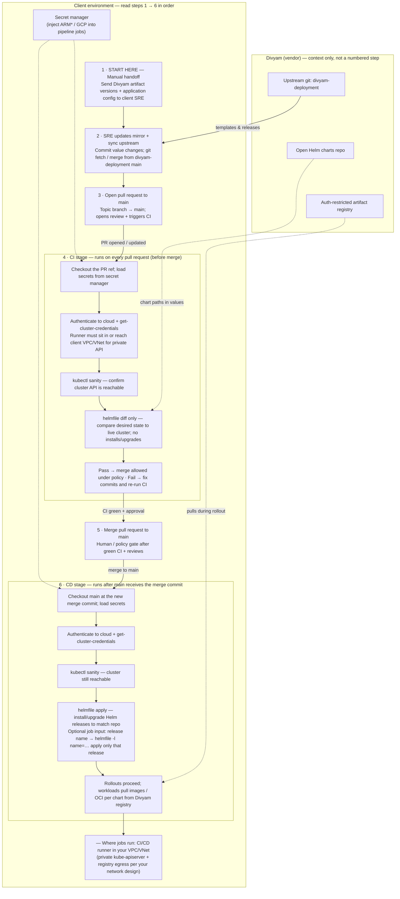

# Divyam Kubernetes CI/CD Overview (Client SRE Mirror Model)



> [!NOTE]
> **How to read this:** start at **1** and follow the arrows through **6**. **4** is **CI only** (`helmfile diff`, no mutations). **5** is the **merge gate**. **6** is **CD only** (`helmfile apply`, mutates cluster). The Divyam row is **context** (upstream git, open charts, restricted registry). The **secret manager** is client-owned; the **runner** must use **your VPC/VNet** (or equivalent) so **kube-apiserver** and **registry** paths work.

This document defines a tool-agnostic CI/CD model for client SRE teams maintaining a mirrored copy of the `divyam-deployment` repository.

## 1. Operating Model

- The client SRE team maintains an internal mirror of the `divyam-deployment` repo.
- Application and config updates are provided manually to the SRE team (for example artifact versions and config changes).
- SRE updates mirrored repository files, pulls latest upstream `divyam-deployment` changes, and raises a PR to `main`.
- CI runs on PR and validates the proposed deployment using `helmfile diff` against the target cluster.
- PR can be merged only after CI succeeds.
- CD runs only after merge to `main` and executes deployment using `helmfile apply`.

## 2. Network and Runtime Requirement

The CI and CD pipeline runners must be deployed in the same VPC/VNet (or have equivalent private network connectivity) as the Kubernetes cluster so API server access is available during validation and deployment.

Without cluster connectivity:

- CI cannot run a meaningful `helmfile diff` against live state.
- CD cannot run `helmfile apply`.

> [!WARNING]
> If the runner cannot reach the cluster control plane or Divyam’s **auth-restricted artifact registry** over the paths your charts require, `helmfile diff` / `helmfile apply` will fail or be misleading. Align network paths (peering, Private Google Access, Azure Private Link, allowlisted egress, etc.) with your platform team before go-live.

## 3. Branching and Trigger Policy

- Target branch for deployment changes: `main`
- CI trigger: pull request events only
- CD trigger: merge/push to `main` only

Recommended policy:

- Protect `main` with mandatory CI status check.
- Disallow direct pushes to `main`.

## 4. Pipeline secret manager (required)

Material that can **authenticate** or **decrypt access** to your cloud or cluster must **never** be committed to git. Use the **pipeline platform’s secret manager** (Jenkins credentials, GitLab masked variables, GitHub Actions secrets, Azure DevOps secret variables, HashiCorp Vault from the runner, etc.) for those values, or equivalent controls your InfoSec team approves.

### 4.1 Which values must be “secret” vs identifiers?

| Variable | Treat as | Guidance |
| --- | --- | --- |
| `ARM_CLIENT_SECRET` | **Secret (required)** | Password-equivalent for the service principal. **Must** live only in a secret manager (or vault) with least-privilege access from the CD job identity. |
| `GCP_SA_KEY_JSON` | **Secret (required)** | Full private key JSON for the GCP service account. Same as above. |
| `KUBECONFIG_CONTENT` | **Secret (if used)** | Contains credentials or tokens. Only store if you use a pre-baked kubeconfig flow. |
| `ARM_CLIENT_ID` | Identifier (low sensitivity) | Public-ish application ID; still restrict who can read it. Often stored as a **plain pipeline variable** with RBAC, or alongside other `ARM_*` in one credential bundle for simplicity. |
| `ARM_TENANT_ID` | Identifier (low sensitivity) | Tenant UUID is not a password; same storage options as `ARM_CLIENT_ID`. |
| `ARM_SUBSCRIPTION_ID` | Identifier (low sensitivity) | Subscription GUID is commonly visible in Azure Portal and ARM URLs; still avoid broadcasting it. Plain variables are typical. |

> [!NOTE]
> **You are not required to put all four `ARM_*` values only inside a “secrets” product.** Minimum bar: **`ARM_CLIENT_SECRET` must never appear in logs, job config in clear text, or git.** Many teams still store `ARM_CLIENT_ID`, `ARM_TENANT_ID`, and `ARM_SUBSCRIPTION_ID` in the same secret object as the password for operational simplicity — that is fine if access is locked down.

Azure variable **names** use **`ARM_*`** consistently with OpenTofu/Terraform and the rest of this repository. Map them from `az ad sp create-for-rbac` (or your enterprise credential process).

### 4.2 Reference list (names your jobs should read)

| Name | Used when |
| --- | --- |
| `GCP_SA_KEY_JSON` | GCP / GKE |
| `ARM_CLIENT_ID`, `ARM_CLIENT_SECRET`, `ARM_SUBSCRIPTION_ID`, `ARM_TENANT_ID` | Azure / AKS |
| `KUBECONFIG_CONTENT` | Optional alternative to cloud CLI `get-credentials` |

### 4.3 Non-secret runtime parameters

Suggested as plain pipeline variables or environment variables:

- `CLUSTER_PROVIDER` (`gcp` or `azure`)
- `HELMFILE_ENV` (example: `prod`, `preprod`)
- `HELMFILE_VALUES_DIR` (path to values directory)
- `HELMFILE_FILE` (default: `helmfile.yaml.gotmpl`)

## 5. Tooling and Image

A common image is used for both CI and CD:

- `pipeline/Dockerfile`

It installs required tooling on a **pinned** Ubuntu base (`ubuntu:24.04`, not the `:latest` tag):

- `helm`
- `helmfile`
- `kubectl`
- `helm diff` plugin
- cloud CLIs (`gcloud`, `az`)
- `jq`, `yq`, and core shell tooling

> [!TIP]
> Keep `helmfile` and `helm-diff` versions aligned with [k8s/README.md](../README.md) where explicit versions are documented; bump the Dockerfile `ARG`s when you change those baselines.

Shared shell logic for CI and CD lives in:

- `pipeline/scripts/lib.sh`

Entrypoints:

- `pipeline/scripts/ci_validate.sh`
- `pipeline/scripts/cd_deploy.sh`

## 6. CI Flow (PR Validation)

Goal: validate pending changes against live cluster before merge.

High-level flow:

1. Validate required inputs and secrets.
2. Authenticate to cloud and fetch cluster credentials.
3. Confirm cluster access (`kubectl get ns`).
4. Run **`helmfile diff` only**.
5. Exit non-zero on diff command failure (pipeline failure blocks merge).

## 7. CD Flow (Post-Merge Deployment)

Goal: deploy merged `main` changes to target cluster.

**Optional release selector (pipeline input):** Configure the CD job so operators can pass an **optional** Helmfile release name for a **targeted** deploy (same semantics as `helmfile -l name=<release> apply`). Typical patterns:

- A **job parameter** / **workflow input** (e.g. “Release selector”, empty = full apply).
- An environment variable such as `RELEASE_SELECTOR` that your wrapper passes through to `pipeline/scripts/cd_deploy.sh --selector <name>`.

If the selector is **empty**, run a **full** `helmfile apply` for all releases. If it is **set**, run apply only for that release label.

High-level flow:

1. Validate required inputs and secrets.
2. Authenticate to cloud and fetch cluster credentials.
3. Confirm cluster access (`kubectl get ns`).
4. Deploy with:
   - **full rollout** (default): `helmfile apply`
   - **targeted rollout** (when selector input is set): `helmfile -l name=<release> apply`

## 8. Mirror Repo Update Sequence (Typical)

1. Sync mirror repo with latest upstream `divyam-deployment/main`.
2. Update artifact/version files and environment configuration files.
3. Raise PR to `main`.
4. CI runs `helmfile diff`.
5. Merge PR after successful CI.
6. CD triggers and runs `helmfile apply`.

## 9. Reference Commands (Auth)

GCP (service account key file on disk — path from secret materialization):

```bash
gcloud auth activate-service-account --key-file "$GOOGLE_APPLICATION_CREDENTIALS"
gcloud container clusters get-credentials divyam-gke-prod-1-asia-south1 --region=asia-south1 --project divyam-production
```

Azure (service principal via **`ARM_*`** variables — inject from secret manager):

```bash
az login --service-principal \
  --username "$ARM_CLIENT_ID" \
  --password "$ARM_CLIENT_SECRET" \
  --tenant "$ARM_TENANT_ID"

az account set --subscription "$ARM_SUBSCRIPTION_ID"
az aks get-credentials --resource-group <YourResourceGroup> --name <YourClusterName> --overwrite-existing
```

Replace resource group, cluster name, region, and project with your environment’s values.
